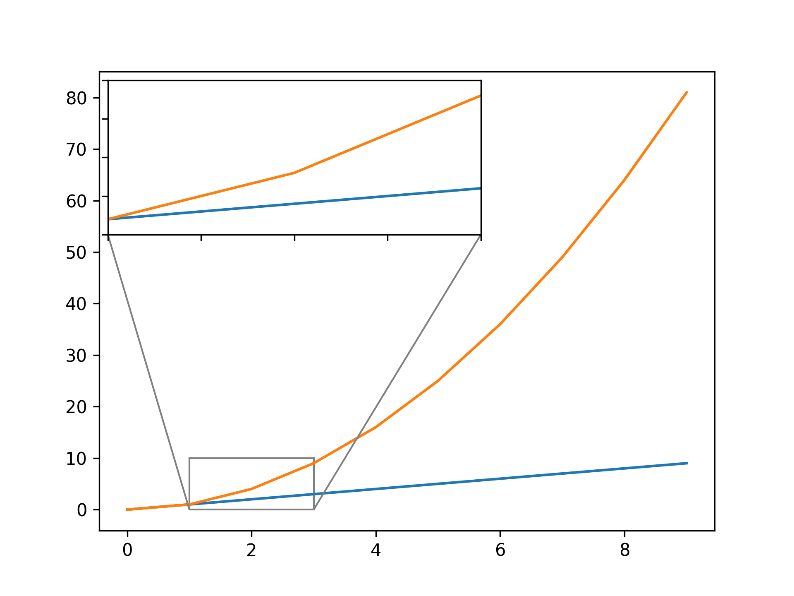

# Basics

### Main 
```python
def main():
    pass

if __name__ == "__main__":
    main()
```

### Dict with default values
```python
from collections import defaultdict
d = defaultdict(int)
d['key'] += 1 # d['key'] == 1
d = defaultdict(list)
d['key'].append(1) # d['key'] == [1]
```

# Matplotlib

```python
import matplotlib as mpl
import matplotlib.pyplot as plt
```

### Font Sizes ([source](https://stackoverflow.com/a/39566040/2069380))
```python
plt.rc('font', size=SMALL_SIZE)          # controls default text sizes
plt.rc('axes', titlesize=SMALL_SIZE)     # fontsize of the axes title
plt.rc('axes', labelsize=MEDIUM_SIZE)    # fontsize of the x and y labels
plt.rc('xtick', labelsize=SMALL_SIZE)    # fontsize of the tick labels
plt.rc('ytick', labelsize=SMALL_SIZE)    # fontsize of the tick labels
plt.rc('legend', fontsize=SMALL_SIZE)    # legend fontsize
plt.rc('figure', titlesize=BIGGER_SIZE)  # fontsize of the figure title
```
Or:
```python
mpl.rc('font', size=SMALL_SIZE)
mpl.rc('axes', titlesize=SMALL_SIZE)
# and so on...
```

## Standalone Legends 
```python
from matplotlib.transforms import Bbox
import numpy as np
```

### Lines
```python
from matplotlib.lines import Line2D
lines = [ 
	Line2D([0,1],[0,1], color='black', linestyle='-'),
	Line2D([0,1],[0,1], color='black', linestyle='--'),
      ]
plt.legend(lines, ['One', 'Two'], loc=(-0.0,-0.25), ncol=2)
bbox = Bbox(np.array([[0.7,-0.45],[2.6,-0.06]]))
plt.savefig(f'graphics/legend-lines.png', dpi=300, bbox_inches=bbox)
plt.clf()
```


### Patches
```python
import matplotlib.patches as mpatches
patches = [ 
	mpatches.Patch(label="One", color='red'),
	mpatches.Patch(label="Two", color='blue'), 
      ]
plt.legend(handles=patches, loc=(-0.0,-0.25), ncol=3)
bbox = Bbox(np.array([[0.7,-0.45],[2.6,-0.06]]))
plt.savefig(f'graphics/legend-patches.png', dpi=300, bbox_inches=bbox)
plt.clf()
```


## Zoom on Plot
```python
from mpl_toolkits.axes_grid1.inset_locator import zoomed_inset_axes, mark_inset
fig, ax = plt.subplots()
x, y1, y2 = range(10), range(10), [x**2 for x in range(10)]
plt.plot(x, y1)
plt.plot(x, y2)
# Zoom Plots
axins = zoomed_inset_axes(ax, zoom=3, loc=2) 
axins.plot(x, y1)
axins.plot(x, y2)
# Zoom Limits
axins.set_xlim(x[1], x[3])
axins.set_ylim(y1[1]-1, y2[3]+1)
plt.xticks(visible=False)
plt.yticks(visible=False)
# Corner Lines
mark_inset(ax, axins, loc1=3, loc2=4, fc="none", ec="0.5")
plt.savefig(f'graphics/zoom-on-plot.png', dpi=300)
plt.clf()
```

